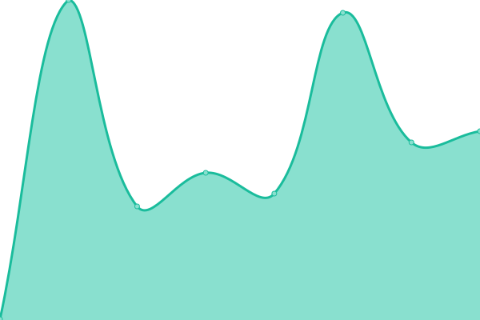
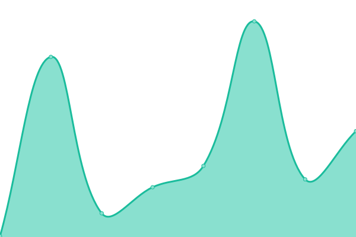

# [📈 Live Status](https://status.cloudrangecyber.com): <!--live status--> **🟧 Partial outage**

This repository contains the open-source uptime monitor and status page for [ActualTom](https://status.cloudrangecyber.com), powered by [Upptime](https://github.com/upptime/upptime).

With [Upptime](https://upptime.js.org), you can get your own unlimited and free uptime monitor and status page, powered entirely by a GitHub repository. We use [Issues](https://github.com/ActualTom/crc-uptime/issues) as incident reports, [Actions](https://github.com/ActualTom/crc-uptime/actions) as uptime monitors, and [Pages](https://status.cloudrangecyber.com) for the status page.

<!--start: status pages-->
<!-- This summary is generated by Upptime (https://github.com/upptime/upptime) -->
<!-- Do not edit this manually, your changes will be overwritten -->
<!-- prettier-ignore -->
| URL | Status | History | Response Time | Uptime |
| --- | ------ | ------- | ------------- | ------ |
|  [Cloud Range Homepage](https://www.cloudrangecyber.com) | 🟩 Up | [cloud-range-homepage.yml](https://github.com/ActualTom/crc-uptime/commits/HEAD/history/cloud-range-homepage.yml) | 

 323ms
     
 | 

<a href="https://ActualTom.github.io/crc-uptime/history/cloud-range-homepage">100.00%</a>
    

|  [Performance Portal](https://certification.cloudrangecyber.com) | 🟩 Up | [performance-portal.yml](https://github.com/ActualTom/crc-uptime/commits/HEAD/history/performance-portal.yml) | 

 294ms
     
 | 

<a href="https://ActualTom.github.io/crc-uptime/history/performance-portal">100.00%</a>
    

|  [Range Access Portal](https://range.cloudrangecyber.com) | 🟩 Up | [range-access-portal.yml](https://github.com/ActualTom/crc-uptime/commits/HEAD/history/range-access-portal.yml) | 

 182ms
     
 | 

<a href="https://ActualTom.github.io/crc-uptime/history/range-access-portal">100.00%</a>
    

|  [Test Broken Site](https://thissitedoesnotexist.koj.co) | 🟥 Down | [test-broken-site.yml](https://github.com/ActualTom/crc-uptime/commits/HEAD/history/test-broken-site.yml) | 

 0ms
     
 | 

<a href="https://ActualTom.github.io/crc-uptime/history/test-broken-site">100.00%</a>
    

<!--end: status pages-->

[**Visit our status website →**](https://status.cloudrangecyber.com)

## 📄 License

- Powered by: [Upptime](https://github.com/upptime/upptime)
- Code: [MIT](./LICENSE) © [ActualTom](https://status.cloudrangecyber.com)
- Data in the `./history` directory: [Open Database License](https://opendatacommons.org/licenses/odbl/1-0/)
